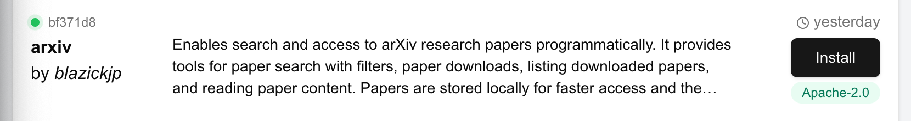
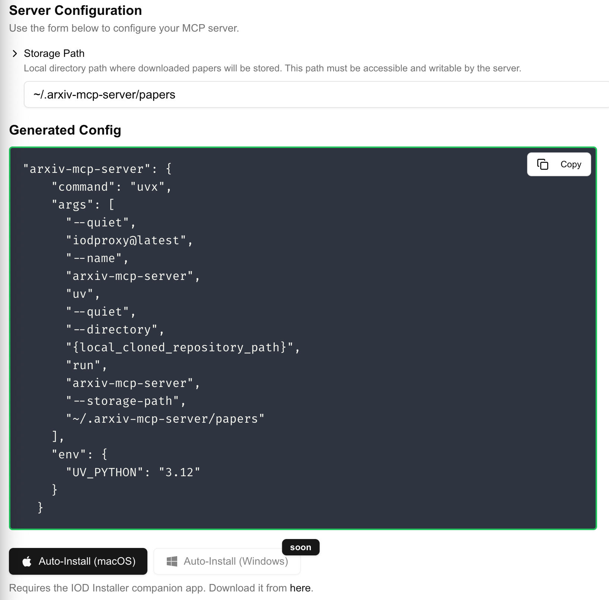

# IOD App

IOD App is a desktop application enabling one-click install of MCP servers in your Claude Desktop Application.

## Usage

### Prerequisites

1. Install the Claude Desktop Application from [here](https://claude.ai/download).
2. Install the IOD Application from [here](https://iod.ai/downloads).

### Instructions

1. Open the IOD App and click on the "go to website" button.

this will open the IOD website in another window.

2. In the IOD website window search for the MCP server you are interested in.

3. Click on the "Install" button next to it.

Some servers requires some configuration to be provided. A form will be displayed for you to complete any missing information.

In that instance for the arxiv mcp server a storage path to a folder is required. Note that a default value is provided and works in most cases.

4. Finally click on the 'Auto-Install' button at the bottom of the form. This will trigger the iod application to install the MCP server for you in your Claude Desktop Application.

Once the server is installed by iod, the application should show a success notification. The Claude Desktop App will restart to complete the installation.

## Contributions

We welcome contributions to this project. Please feel free to open a PR or an issue if you have any suggestions or improvements.
